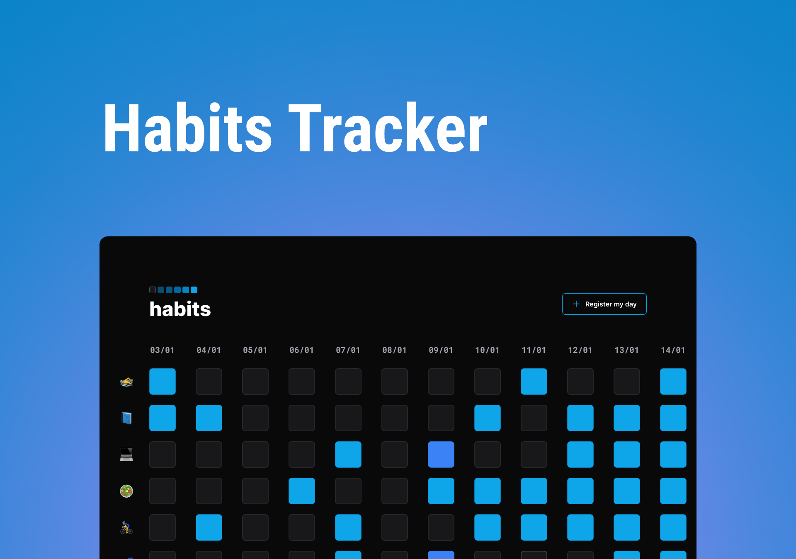

<h1 align="center"> Habits Tracker </h1>

&nbsp;&nbsp;An application that allows the user to mark and control their habits. 

  <a href="#-Technologies">Technologies</a>&nbsp;&nbsp;&nbsp;|&nbsp;&nbsp;&nbsp;
  <a href="#-project">Project</a>&nbsp;&nbsp;&nbsp;|&nbsp;&nbsp;&nbsp;
  <a href="#memo-license">License</a>

  

 

  

## 🚀 Technologies

This project was created with the following technologies:

- HTML 
- CSS
- JavaScript
- JSON
- Git and Github
- Figma
- SASS/SCSS

## 💻 Project

&nbsp;&nbsp;2023, a brand new year! How about make this year the best of your life? To accomplish that, you must invest in good habits, and control the bad ones.  
&nbsp;&nbsp;Thinking about that, I created the Habit Tracker, an application that allows you tag and control your habits.

- [Access the project online](https://)

## :memo: Licence

This project is under the MIT licence.